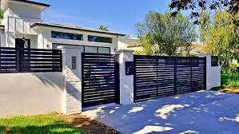

# DeluxFence

**Architectural-grade aluminum fencing** for American homes. A modern marketing and catalog website for premium fence systems—maintenance-free, elegant, built for every setting.



## What This Project Does

- **Marketing site**: Hero, product showcase, gallery, “Why Aluminum,” contact form.
- **Product catalog (PDF)**: Downloadable catalog with fence photos and contact info (`/api/catalog/pdf`).
- **Gallery**: 18 fence images (single photos, grid panels, gate) with slider and “Jump to a photo” navigation.
- **Responsive**: Mobile-first layout with Tailwind CSS; navbar with hamburger menu on small screens.
- **Live support**: Floating chat-style widget; contact form with phone, email, and address.

## Tech Stack

| Area | Technology |
|------|------------|
| Framework | [Next.js 14](https://nextjs.org/) (App Router) |
| Styling | [Tailwind CSS](https://tailwindcss.com/) |
| Animations | [Framer Motion](https://www.framer.com/motion/) |
| Icons | [Lucide React](https://lucide.dev/) |
| PDF catalog | [@react-pdf/renderer](https://react-pdf.org/) |
| Language | TypeScript |

## Prerequisites

- **Node.js** 18+ (LTS recommended)
- **npm** (or yarn / pnpm)

## Setup & Run

### 1. Clone the repository

```bash
git clone https://github.com/SanliData/deluxfence.git
cd deluxfence
```

### 2. Install dependencies

```bash
npm install
```

### 3. Run in development

```bash
npm run dev
```

Open [http://localhost:3000](http://localhost:3000) in your browser.

### 4. Build for production

```bash
npm run build
npm start
```

### 5. Lint

```bash
npm run lint
```

## Project Structure

```
deluxfence/
├── app/
│   ├── layout.tsx          # Root layout, metadata, Navbar, LiveSupport
│   ├── page.tsx            # Home: Hero, Showcase, WhyAluminum, Contact
│   ├── globals.css         # Tailwind + custom (anthracite, gold, buttons)
│   ├── gallery/            # Gallery page with slider & thumbnails
│   ├── products/           # Products page
│   ├── projects/           # Projects page
│   ├── why-aluminum/       # Why Aluminum page
│   └── api/
│       └── catalog/pdf/    # GET → PDF catalog download
├── components/
│   ├── Navbar.tsx          # Sticky nav, desktop + mobile menu
│   ├── Hero.tsx            # Full-viewport hero
│   ├── HomeShowcase.tsx    # Product/showcase sections
│   ├── WhyAluminum.tsx     # Benefits (icons + copy)
│   ├── ContactForm.tsx     # Form + contact block (phone, email, address)
│   ├── LiveSupport.tsx     # Floating support widget
│   ├── GallerySlider.tsx   # Gallery slider + dots
│   └── FenceImage.tsx      # Single/grid fence image renderer
├── lib/
│   ├── aluminum-fence-images.ts   # Fence photo list (single + grid + gate)
│   └── usa-images.ts              # Hero/gallery/feature image paths
├── public/
│   └── images/fence/       # Fence images (PNG)
├── tailwind.config.ts      # Anthracite, gold, font
└── next.config.mjs
```

## Main Features

- **Modular components**: Header, Hero, Showcase, WhyAluminum, ContactForm, LiveSupport, GallerySlider, FenceImage.
- **Responsive design**: Tailwind breakpoints; mobile menu; aspect-ratio and overflow handling for gallery.
- **SEO**: Metadata (title, description) in `layout.tsx`; semantic headings and structure.
- **PDF catalog**: `GET /api/catalog/pdf` returns a multi-page PDF (cover, intro, gallery, contact). Linked in nav as “Catalog (PDF)”.
- **Quote calculator**: Optional estimator on the contact section (length/height → linear feet + “Request a quote” CTA).

## Environment

- No required env vars for basic run.
- For production, set your own contact/analytics keys if you add them later.

## License

This project is licensed under the MIT License—see the [LICENSE](LICENSE) file for details.

## Demo

After deploying (e.g. Vercel, Netlify, or GitHub Pages with static export), add your live URL here:

```text
Demo: https://your-deluxfence-demo.vercel.app
```

---

**DeluxFence** — One fence system for every setting. Endless possibilities.
